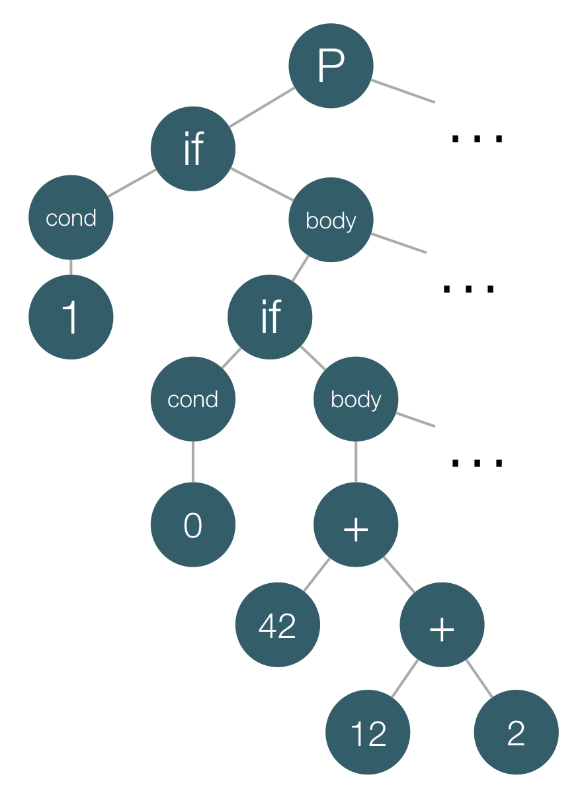

So far, most of the blog posts I've written are tutorials; they explain how we can use technologies, architectures, etc. For instance:

- [Flux in Depth. Store and Network Communication.](http://blog.mgechev.com/2015/07/18/flux-in-depth-store-network-communication-services)
- [ViewChildren and ContentChildren in Angular 2](http://blog.mgechev.com/2016/01/23/angular2-viewchildren-contentchildren-difference-viewproviders)
- [Build Your own Simplified AngularJS in 200 Lines of JavaScript](http://blog.mgechev.com/2015/03/09/build-learn-your-own-light-lightweight-angularjs)
- [Remote Desktop Client with AngularJS and Yeoman](http://blog.mgechev.com/2014/02/08/remote-desktop-vnc-client-with-angularjs-and-yeoman/)

The current post is about a project I am interested in. A few days ago I explained my motivation behind the ["Community-drive Style Guide" for Angular 2](https://github.com/mgechev/angular2-style-guide) that we're working on. I also mentioned that I am planning to build a configurable static-code analyzer, which makes sure given project follows best practices and is correct Angular 2 code.

I called this project [ng2lint](https://github.com/mgechev/ng2lint. Lets explain the scope of the analyzer I'm going to discuss in this article.

### Following the Best Practices

Although in most cases there's quite a good understanding of what best practices are, some of them, especially the ones related to coding style depend on personal preferences. This means that a universal static-code analyzer should be configurable in order to allow enforce some practices but disable anothers, or simply change the configuration of such.

For instance, according to best practices described in the [Angular 2 style guide](https://github.com/mgechev/angular2-style-guide) directives should be used as attributes and components should be used as elements. However, in some specific environment when we have a legacy project which uses different conventions we should be able to adapt to the way the project is written.

### Following Style guidelines

By following style guidelines I mean typical linting, such as the one introduced by tslint. The Angular 2 Style Guide provides some sample tslint configuration file, which can be used.

As extension of the functionality provided by tslint the [ng2linter]((https://github.com/mgechev/ng2lint) should introduce filename checking, based on the conventions defined the style guide.

### Correctness

By saying correct I mean that the project follows some rules, which are enforced by the Angular framework, such as:

- All used inside the templates pipes need to be declared.
- All custom attributes of elements in the templates should be declared as either inputs, outputs or directives.
- Misspelled method name in an expression used within a template.
- etc.

### Out of Scope

Since TypeScript is a statically typed language it already provides type-safety. This helps us eliminate huge part of the code validation thanks to the TypeScript compiler, which can slap our hands in case we misspell an identifier name or keyword.

### Benefits of the linter

Project like this will allow us to receive text editor/IDE warnings for:

- Not following best practices for Angular 2 application development.
- Not following style guidelines our team has agreed upon.
- Incorrect Angular 2-specific code.

## Clash Course in Parsing

The input of any compiler is a file which contains a text that needs to be processed. Two top-level goals of the compiler are to:

- Verify whether the input program belongs to the programming language defined with given [grammar](https://en.wikipedia.org/wiki/Extended_Backus%E2%80%93Naur_Form).
- Execute the program or translate it to a target format.

For our purpose we are interested only in the first goal, which is part of the front-end of any compiler.

Before explaining the challenges and the current results I got in ng2lint, let make a quick overview of how the front-end of a compiler works. The front-end of any compiler always contains the following modules:

- Lexer
- Parser

### Introducing the Lexer

The main purpose of the lexer (a.k.a. tokenizer, scanner) is to take the input character stream and output a stream of tokens. Each token has a "lexeme" which is the actual substring of the program and a "type".

For instance, lets take a look at the following program:

```
if (1) {
  if (0) {
    42 + 12 + 2
  }
  2 + 3
}
```
We can implement our parser so it returns an array of JavaScript object, each of which represent an individual token. The first a couple of tokens are going to be:

```js
[
  {
    lexeme: 'if',
    type: 'keyword',
    position: {
      line: 0,
      char: 0
    }
  },
  {
    lexeme: '(',
    type: 'open_bracket'
    position: {
      line: 0,
      char: 3
    }
  },
  {
    lexeme: 1,
    type: 'number',
    position: {
      line: 0,
      char: 4
    }
  },
  {
    lexeme: ')',
    type: 'close_bracket',
    position: {
      line: 0,
      char: 5
    }
  },
  ...
]
```

If you are interested in further reading about lexical analysis I'd recommend you to get familiar with:

- [Finite Automata](https://en.wikipedia.org/wiki/Finite-state_machine)
- [Regular Expressions](https://en.wikipedia.org/wiki/Regular_expression)

### Parsing

Now we have a stream of tokens. For some [syntax-directed compilers](https://en.wikipedia.org/wiki/Syntax-directed_translation) this could be enough. However, in most cases we need to build an intermediate representation of the program that brings more semantics based on the rules in the grammar and the token stream.

This may sound a bit complex at first but actually it isn't. The process of developing lexers and parsers usually contains the same repetive steps across compilers for different languages so that is why there are tools which allow you to generate these two modules based on the grammar.

Deep-dive in parsers is out of the scope of the current article but lets say a few words about the basics. What is this "intermediate representation" that we build based on the token stream and the language's grammar? Well, we build a tree, more accurately an [abstract syntax tree](https://en.wikipedia.org/wiki/Abstract_syntax_tree) (**AST**).

Lets take a look at the AST of the program above:



In case you're interested in further reading about parsers, take a look at the following resources:

- [Context-free grammars](https://en.wikipedia.org/wiki/Context-free_grammar)
- [Extended Backus–Naur Form](https://en.wikipedia.org/wiki/Extended_Backus%E2%80%93Naur_Form)
- [Abstract syntax trees](https://en.wikipedia.org/wiki/Abstract_syntax_tree)

### One more step...

We're almost done with the theory behind ng2lint. In this final step we will just peek at the backend of any compiler by introducing a classical design pattern which is exclusively used there.

> In object-oriented programming and software engineering, the [visitor design pattern](https://en.wikipedia.org/wiki/Visitor_pattern) is a way of separating an algorithm from an object structure on which it operates.

How we can use this pattern in order to interpret the program we defined above, using its intermediate AST representation?

Here's how we can develop a visitor for this purpose:

```ts
class InterpretationVisitor {
  execute(ast) {
    ast.statements.forEach(this.visitNode.bind(this));
  }
  visitNode(node) {
    switch (node.type) {
      case 'if_statement':
      return this.visitIfStatement(node);
      break;
      case 'expression':
      return this.visitExpression(node);
      break;
      default:
      throw new Error('Unrecognized node');
    }
  }
  visitIfStatement(node) {
    if (this.visitNode(node.condition)) {
      node.statements.forEach(this.visitNode.bind(this));
    }
  }
  visitExpression(node) {
    if (node.operator) {
      return this.visitNode(node.left) + this.visitNode(node.right);
    }
    return node.value;
  }
}
```

Now all we have to do in order to interpret the program is to:

```ts
let visitor = new InterpretationVisitor();
visitor.execute(root);
```

Using similar approach we can as well analyze the program. [`tslint`](https://github.com/palantir/tslint) for instance uses similar approach for the implementation of the rules it provides.

Lets peek at a sample rule definition:

```ts
import * as ts from "typescript";
import * as Lint from "../lint";

export class Rule extends Lint.Rules.AbstractRule {
    public static FAILURE_STRING = "type decoration of 'any' is forbidden";

    public apply(sourceFile: ts.SourceFile): Lint.RuleFailure[] {
        return this.applyWithWalker(<Lint.RuleWalker>(new NoAnyWalker(sourceFile, this.getOptions())));
    }
}

class NoAnyWalker extends Lint.RuleWalker {
    public visitAnyKeyword(node: ts.Node) {
        this.addFailure(this.createFailure(node.getStart(), node.getWidth(), Rule.FAILURE_STRING));
        super.visitAnyKeyword(node);
    }
}
```

The rule above forbids defines two classes:

- `Rule` - internally `tslint` creates instances of the rule classes and invokes them over the individual files by calling their `apply` method.
- `NoAnyWalker` - a visitor which extends the `RuleWalker` class which provides some primitives for `RuleWalker`s. The `NoAnyWalker` overrides the definition of the `visitAnyKeyword` method and reports a failure once it finds "`any` decorations".

For instance:

```ts
let foo: any = 32;
```

Will fail with `type decoration of 'any' is forbidden`.