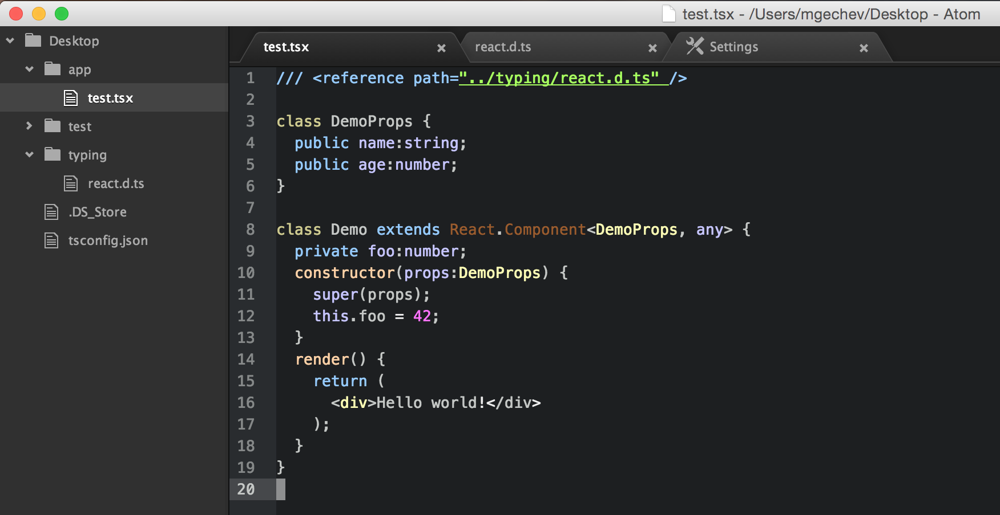

JavaScript is a weird language although, we love it the way it is. However, I've had quite a painful experience working on big JavaScript projects. It was painful in the same way it gets painful working on huge Ruby, Python, PHP projects.

Once you have code base above 10-15k lines of code and you decide to do some refactoring...well it gets messy. Although `grep` and `sed` are powerful tools for text manipulation, when you start replacing code with them, you're missing the semantics (or the context) of the snippets you substitute.

Another common problem - you simply misspell a variable or property name and once in a while your code breaks telling you: `undefined is not a function` (alright, we [passed this stage](https://twitter.com/addyosmani/status/569157136137134081)...)

How we can deal with these problems using our favorite language? Well, writing a lot of tests may help. Testing everything is good but testing everything in order to make our refactoring process slightly smoother and staying away from typos...seems kind of unpractical and workaround.

## TypeScript

What we can do is change the language we're using. Replace it with something more powerful - TypeScript. TypeScript is JavaScript superset. Using TypeScript gives us a couple of benefits:

- You get type errors compile-time and runtime (since version 1.5 TypeScript has run-time type checking). This way it'll be easier to debug your code and you will be more secure that what you've developed actually works.
- You get better auto-completion by the text editors and IDEs. WebStorm 10 supports TypeScript 1.5 + decorators and ES6 modules. For vim you can use the typescript-tools, which could be integrated with emacs and SublimeText. You will get hints for method names, parameters, parameters types by your editor/IDE for each method (yes, with Tern.js or Flow you can get the same experience but based on JSDoc or some very sophisticated decisions made using the AST of your code, now it'll be much less tricky).
- The JavaScript VM is able to make better code optimizations. Since when we define that given property/variable has specific type we sign some kind of contract with the JavaScript VM, this way it is much easier for it to reason about the types of the variables, which are being used and to do better runtime optimizations (for instance).

So you get smoother refactoring experience (yey!), faster code and a compiler, which can slap your hands if you misspell a property or a variable name. And the static typing - it is optional. If you don't want to, you don't need to provide type information (however, I'd recommend you to be consistent in most cases). You can learn more about TypeScript [here](http://www.typescriptlang.org/Tutorial).

## The Problem

However, famous frameworks and libraries, like React, AngularJS 1, Backbone, jQuery, etc. are not written in TypeScript so we don't gain any benefits like auto-completion and type checking when using them.

On top of this React has this weird extension of JavaScript called JSX, which allows us to embed markup inside our JavaScript...

## The Solution

The guys from Microsoft, designing TypeScript, were quite smart and took the first problem under consideration. From the first version of the language were introduced the ambient type definitions. Basically, you can provide definition of the interface of an external library and include reference to it inside the files where you use it. This way you get type checking and text editors auto-completion support. How awesome is that?

In [DefinitelyTyped](https://github.com/borisyankov/DefinitelyTyped) you can find up-to-date type definitions for most libraries you may want to use. Once you got, lets say the React type definition, you can simply add a reference to it inside the files you use React like:


/// <reference path="react.d.ts" />

// ... your awesome code here


Alright, TypeScript introduced these ambient type definitions. Cool. However, this doesn't solve our JSX problem. What if we want to use JSX inside our TypeScript & React project? Well, for a couple of weeks, I'm following [this GitHub issue](https://github.com/Microsoft/TypeScript/issues/3203), which aims decoupling of TypeScript from JSX. A few days ago a patch was merged into the master branch of TypeScript, which allows to transform your TypeScript to JavaScript and keep your JSX markup or transpile it to React calls instead!

## How to do That?

As last step, I'm going to show you how we can take advantage of this feature today!

Install TypeScript inside a directory:


mkdir test-typescript-project
cd test-typescript-project
git clone https://github.com/Microsoft/TypeScript.git
cd TypeScript
npm install -g jake
npm install
jake local


Now create an `app` directory and enter it:


mkdir app
cd app


Create a sample file called `test.tsx` (notice the extension **tsx**, it is mandatory) and add the following content:


/// <reference path="../typing/react.d.ts" />

class DemoProps {
  public name:string;
  public age:number;
}

class Demo extends React.Component<DemoProps, any> {
  private foo:number;
  constructor(props:DemoProps) {
    super(props);
    this.foo = 42;
  }
  render() {
    return (
      
Hello world!

    );
  }
}


In the code above we defined a component called `Demo`. It accepts properties, which are instances of the class `DemoProps` and state, which could be of any kind.

Alright, we're almost there!

Create a directory called `typing` inside the root of your project:


cd ..
mkdir typing
cd typing


Now take the React's ambient type declaration from [here](https://github.com/borisyankov/DefinitelyTyped/blob/master/react/react.d.ts) and save it inside `typing`. Make sure the file is called `react.d.ts`. This will prevent us from getting any compile-time errors.

And we're almost there!


cd ..
# This line will run the typescript compiler over your `test.tsx` file and
# output the transpiler content in `./app/test.js`
node TypeScript/built/local/tsc.js --jsx react ./app/test.tsx


Thats it. Now you can check out the content of `./app/test.js`. There you should find the transpiled content.
Did you notice the `--jsx` option of the TypeScript compiler? It may accepts two different values:

- `react` - Transpiles JSX to React calls
- `preserve` - Preserves the JSX the way it was defined in the source file

## Results

This is how you can use TypeScript with React and JSX for projects that scale. Support for `tsx` files is already implemented in `atom-typescript`. If you use Atom, you'll see something like this:

